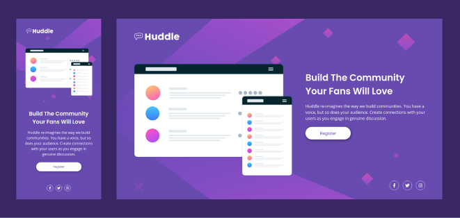

# Frontend Mentor - Huddle landing page with single introductory section

This is a solution to the [Huddle landing page with single introductory section](https://www.frontendmentor.io/challenges/huddle-landing-page-with-a-single-introductory-section-B_2Wvxgi0). Frontend Mentor challenges help you improve your coding skills by building realistic projects.

## Table of contents

- [Overview](#overview)
  - [The challenge](#the-challenge)
  - [Screenshot](#screenshot)
  - [Links](#links)
- [My process](#my-process)
  - [Built with](#built-with)
  - [What I learned](#what-i-learned)
  - [Useful resources](#useful-resources)
- [Author](#author)

## Overview

### The challenge

Users should be able to:

- View the optimal layout depending on their device's screen size

### Screenshot

### Links

- Live Site URL: [https://domingoslatorre-stats-preview-card-component.netlify.app/](https://domingoslatorre-stats-preview-card-component.netlify.app/)
- Solution URL:[https://github.com/domingoslatorre/frontend-mentor-challenges/tree/main/stats-preview-card-component](https://github.com/domingoslatorre/frontend-mentor-challenges/tree/main/stats-preview-card-component) 

## My process

### Built with

- Mobile-first workflow
- BEM methodology with SASS
- Flexbox
- CSS custom properties
- Semantic HTML5 markup

### What I learned

- Background position tricks
- Work with SVG icons and format then with CSS

### Useful resources

- [Using SVG](https://css-tricks.com/using-svg/)

## Author
- Frontend Mentor - [@domingoslatorre](https://www.frontendmentor.io/profile/domingoslatorre)
