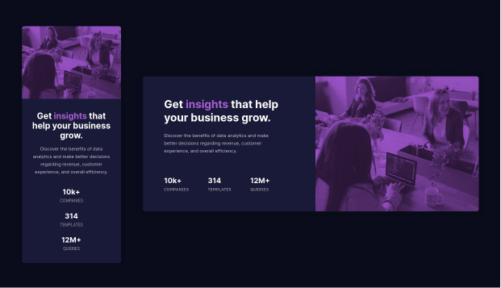

# Frontend Mentor - Stats preview card component solution

This is a solution to the [Stats preview card component challenge on Frontend Mentor](https://www.frontendmentor.io/challenges/stats-preview-card-component-8JqbgoU62). Frontend Mentor challenges help you improve your coding skills by building realistic projects.

## Table of contents

- [Overview](#overview)
  - [The challenge](#the-challenge)
  - [Screenshot](#screenshot)
  - [Links](#links)
- [My process](#my-process)
  - [Built with](#built-with)
  - [What I learned](#what-i-learned)
  - [Useful resources](#useful-resources)
- [Author](#author)

## Overview

### The challenge

Users should be able to:

- View the optimal layout depending on their device's screen size

### Screenshot

### Links

- Live Site URL: [https://domingoslatorre-stats-preview-card-component.netlify.app/](https://domingoslatorre-stats-preview-card-component.netlify.app/)
- Solution URL:[https://github.com/domingoslatorre/frontend-mentor-challenges/tree/main/stats-preview-card-component](https://github.com/domingoslatorre/frontend-mentor-challenges/tree/main/stats-preview-card-component) 

## My process

### Built with

- Mobile-first workflow
- BEM methodology
- Flexbox
- CSS custom properties
- Semantic HTML5 markup

### What I learned

- Use picture HTML element for art direction image (cropped, zoomed)
- Use mix-blend-mode css property

### Useful resources

- [The picture element](https://developer.mozilla.org/en-US/docs/Web/HTML/Element/picture)
- [mix-blend-mode](https://developer.mozilla.org/en-US/docs/Web/CSS/mix-blend-mode) 

## Author
- Frontend Mentor - [@domingoslatorre](https://www.frontendmentor.io/profile/domingoslatorre)
